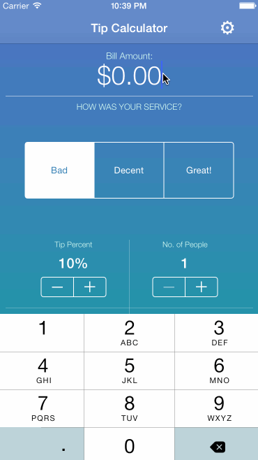

# Tip Calculator by Sarat Tallamraju

The Tip Calculator is an app that lets the user calculate the tip amount and the total, based on the service at the venue. The Tip Calculator
- Features an extremely intuitive UI
- Extremely simple to use
- Designed for maximum utility without adding too much complexity

Time spent: 2 hours until feature completion, 1 hour for code refactoring and documentation, and 5 hours obsessing over UI and Design.

## Completed user stories:

 * [x] Required: User can use the tip calculator to calculate tips in a commont restaurant scenario.
 * [x] Required: User can configure the default values of the tip percents based on the service of the restaurant, in a seperate settings page.
 * [x] Optional: The currency is localized which means that the app will work in many locales.
 
## Notes:

Spent the greatest majority of time figuring out Auto Layout for the UI components in the view, to support all the iPhone form factors.
- Learned about setting inexact constraints (At least 10, at most 50, etc.)
- Used inexact constraints with different priority levels
    - The UI components in the view are therefore more spread out, and will render correctly on all the iPhone form factors.
- Experimented with design by changing the thickness of the font and position of the UI components.
- Experimented with warm vs cool colors for a compelling color theme.
    - Settled with a blue and green combination, as these are typically the colors associated with coolness and money. 
    - The background gradient with these two color adds a iOS 7.0+ -esq look and feel
        - Jony Ive will be happy

# Lets See a Demo!

GIF created with [LiceCap](http://www.cockos.com/licecap/).
